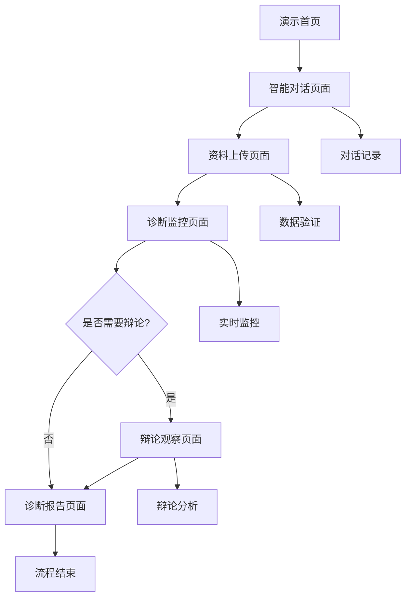

# 多智能体心理诊断演示流程 - 产品需求文档

## 1. 产品概述

连心智诊师多智能体心理诊断演示系统是一个展示AI多智能体协作进行心理疾病诊断的完整流程平台。系统通过总理智能体引导患者完成资料上传，启动多个专业智能体进行协作诊断，并通过辩论机制提升诊断准确性。

本系统旨在展示多智能体系统在心理健康领域的应用潜力，为医疗机构和研究人员提供先进的AI辅助诊断解决方案。

## 2. 核心功能

### 2.1 用户角色

| 角色 | 注册方式 | 核心权限 |
|------|----------|----------|
| 演示用户 | 无需注册，直接访问 | 可体验完整诊断流程，查看演示数据 |
| 患者用户 | 邮箱注册或手机号注册 | 可上传真实数据，获得个人诊断报告 |
| 医生用户 | 邀请码注册 | 可查看患者诊断过程，审核诊断结果 |

### 2.2 功能模块

我们的多智能体心理诊断演示系统包含以下主要页面：

1. **演示首页**：系统介绍、演示入口、多智能体架构展示
2. **智能对话页面**：患者与总理智能体的实时对话界面
3. **资料上传页面**：引导式多模态数据上传流程
4. **诊断监控页面**：实时展示各智能体工作状态和诊断进度
5. **辩论观察页面**：智能体间辩论过程的可视化展示
6. **诊断报告页面**：最终诊断结果和详细分析报告

### 2.3 页面详情

| 页面名称 | 模块名称 | 功能描述 |
|----------|----------|----------|
| 演示首页 | 系统介绍区 | 展示多智能体系统架构图、核心优势、演示视频 |
| 演示首页 | 快速体验区 | 一键启动演示流程、选择演示场景、查看历史演示 |
| 智能对话页面 | 聊天界面 | 实时消息展示、消息输入框、表情和文件发送 |
| 智能对话页面 | 总理智能体 | 智能引导对话、症状询问、上传指导、流程控制 |
| 智能对话页面 | 对话记录 | 完整对话历史、关键信息标记、对话导出功能 |
| 资料上传页面 | 上传引导 | 分步骤上传指导、文件类型说明、上传进度显示 |
| 资料上传页面 | 多模态上传 | fNIRS数据上传、EEG数据上传、音频视频上传 |
| 资料上传页面 | 数据验证 | 文件格式检查、数据完整性验证、质量评估 |
| 诊断监控页面 | 智能体状态 | 各智能体工作状态、任务分配、进度跟踪 |
| 诊断监控页面 | 实时日志 | 诊断过程日志、关键事件记录、错误处理 |
| 诊断监控页面 | 进度可视化 | 整体进度条、阶段性里程碑、预计完成时间 |
| 辩论观察页面 | 辩论界面 | 智能体发言展示、观点对比、论据分析 |
| 辩论观察页面 | 辩论控制 | 辩论启动/暂停、轮次控制、结论生成 |
| 辩论观察页面 | 观点分析 | 不同观点统计、一致性分析、分歧点标记 |
| 诊断报告页面 | 报告展示 | 诊断结论、置信度评分、建议措施 |
| 诊断报告页面 | 详细分析 | 各智能体分析结果、数据解读、风险评估 |
| 诊断报告页面 | 报告操作 | 报告下载、分享链接、打印预览 |

## 3. 核心流程

### 3.1 完整演示流程

**用户体验流程：**
1. 用户访问演示首页，了解系统功能
2. 点击"开始体验"进入智能对话页面
3. 总理智能体主动问候，介绍诊断流程
4. 智能体通过对话了解患者基本情况和症状
5. 引导患者上传相关医疗数据和检测资料
6. 上传完成后自动跳转到诊断监控页面
7. 各专业智能体开始并行分析数据
8. 当出现诊断分歧时，自动启动辩论系统
9. 用户可观察智能体间的辩论过程
10. 辩论结束后生成最终诊断报告
11. 用户查看详细的诊断结果和建议

**智能体工作流程：**
1. 总理智能体负责整体流程协调和用户交互
2. 数据预处理智能体验证和清洗上传的数据
3. fNIRS分析智能体专门分析脑血氧数据
4. EEG分析智能体专门分析脑电波数据
5. 心理评估智能体基于对话内容进行心理分析
6. 综合诊断智能体整合各方面分析结果
7. 当诊断结果存在分歧时，启动辩论协调机制
8. 质量控制智能体监督整个诊断过程的质量

## 4. 用户界面设计

### 4.1 设计风格

- **主色调**：医疗蓝 (#2563EB) 和科技绿 (#059669)
- **辅助色**：温暖灰 (#6B7280) 和警示橙 (#F59E0B)
- **按钮样式**：圆角现代风格，支持悬停和点击动效
- **字体**：主要使用 Inter 字体，中文使用苹方或微软雅黑
- **布局风格**：卡片式布局，左侧导航，响应式设计
- **图标风格**：线性图标配合实心图标，统一使用 Lucide 图标库

### 4.2 页面设计概览

| 页面名称 | 模块名称 | UI元素 |
|----------|----------|--------|
| 演示首页 | 系统介绍区 | 大型横幅图、动态架构图、渐变背景、悬浮卡片效果 |
| 演示首页 | 快速体验区 | 大型CTA按钮、场景选择卡片、进度指示器 |
| 智能对话页面 | 聊天界面 | 消息气泡、头像展示、时间戳、输入框、发送按钮 |
| 智能对话页面 | 总理智能体 | AI头像动画、打字效果、智能提示、快捷回复按钮 |
| 资料上传页面 | 上传引导 | 步骤指示器、拖拽上传区、进度条、成功提示 |
| 资料上传页面 | 多模态上传 | 文件类型图标、预览缩略图、删除按钮、格式说明 |
| 诊断监控页面 | 智能体状态 | 状态指示灯、进度环形图、实时数据更新、动画效果 |
| 诊断监控页面 | 实时日志 | 滚动日志区、时间线展示、关键事件高亮 |
| 辩论观察页面 | 辩论界面 | 对话气泡、智能体头像、观点标签、投票按钮 |
| 辩论观察页面 | 观点分析 | 饼图统计、条形图对比、一致性指标 |
| 诊断报告页面 | 报告展示 | 卡片布局、评分圆环、建议列表、风险等级标识 |
| 诊断报告页面 | 详细分析 | 折叠面板、数据图表、置信度条、下载按钮 |

### 4.3 响应式设计

系统采用移动优先的响应式设计，支持桌面端、平板端和移动端访问。在移动端优化对话界面的触控体验，确保上传和监控功能在小屏幕上的可用性。