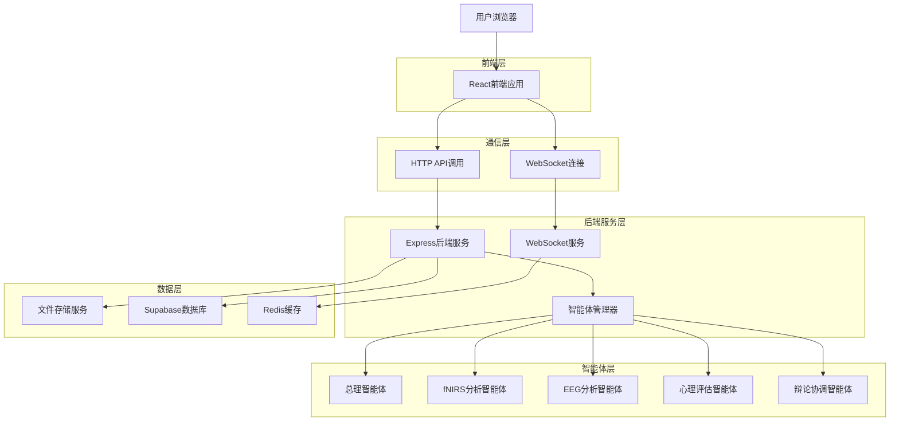
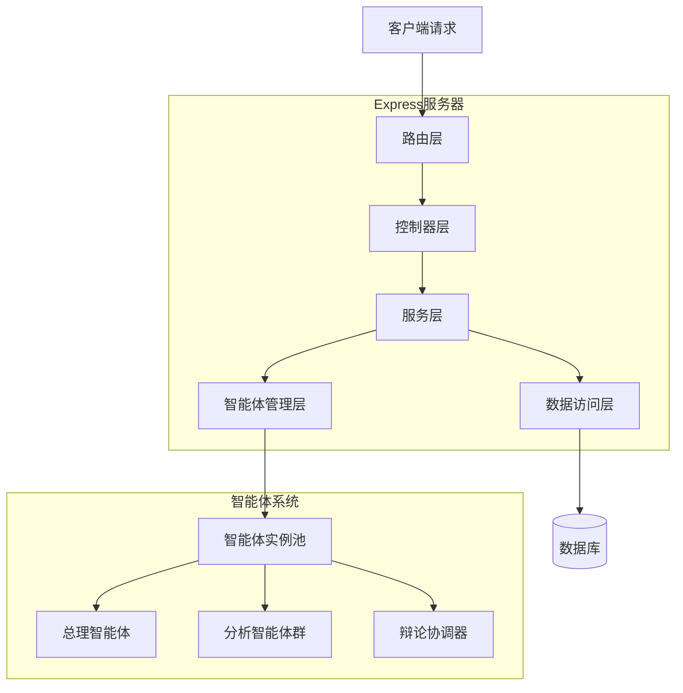
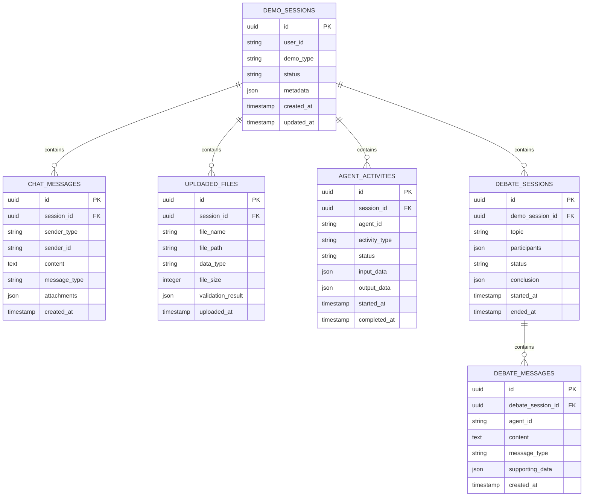

# 多智能体心理诊断演示流程 - 技术架构文档

## 1. 架构设计



## 2. 技术描述

* 前端：React\@18 + TypeScript + Tailwind CSS + Vite

* 后端：Express\@4 + TypeScript + WebSocket

* 数据库：Supabase (PostgreSQL)

* 缓存：Redis

* 文件存储：本地存储 + Supabase Storage

* 智能体框架：自定义多智能体协调框架

* 实时通信：Socket.io

## 3. 路由定义

| 路由                 | 用途                 |
| ------------------ | ------------------ |
| /                  | 演示首页，展示系统介绍和快速体验入口 |
| /demo              | 智能对话页面，患者与总理智能体交互  |
| /upload            | 资料上传页面，多模态数据上传界面   |
| /monitor           | 诊断监控页面，实时展示智能体工作状态 |
| /debate            | 辩论观察页面，智能体辩论过程可视化  |
| /report/:sessionId | 诊断报告页面，显示最终诊断结果    |
| /login             | 用户登录页面（可选功能）       |

## 4. API定义

### 4.1 核心API

**演示会话管理**

```
POST /api/demo/sessions
```

请求：

| 参数名称     | 参数类型   | 是否必需  | 描述                      |
| -------- | ------ | ----- | ----------------------- |
| userId   | string | false | 用户ID（演示模式可为空）           |
| demoType | string | true  | 演示类型：'guided' \| 'free' |

响应：

| 参数名称      | 参数类型   | 描述   |
| --------- | ------ | ---- |
| sessionId | string | 会话ID |
| status    | string | 会话状态 |
| createdAt | string | 创建时间 |

**智能体对话**

```
POST /api/demo/chat
```

请求：

| 参数名称        | 参数类型   | 是否必需 | 描述                    |
| ----------- | ------ | ---- | --------------------- |
| sessionId   | string | true | 会话ID                  |
| message     | string | true | 用户消息内容                |
| messageType | string | true | 消息类型：'text' \| 'file' |

响应：

| 参数名称        | 参数类型      | 描述      |
| ----------- | --------- | ------- |
| reply       | string    | 智能体回复内容 |
| suggestions | string\[] | 建议回复选项  |
| nextAction  | string    | 下一步操作提示 |

**文件上传**

```
POST /api/demo/upload
```

请求：

| 参数名称      | 参数类型    | 是否必需 | 描述                                          |
| --------- | ------- | ---- | ------------------------------------------- |
| sessionId | string  | true | 会话ID                                        |
| files     | File\[] | true | 上传文件列表                                      |
| dataType  | string  | true | 数据类型：'fnirs' \| 'eeg' \| 'audio' \| 'video' |

响应：

| 参数名称              | 参数类型      | 描述        |
| ----------------- | --------- | --------- |
| uploadedFiles     | object\[] | 上传成功的文件信息 |
| validationResults | object    | 数据验证结果    |

**智能体状态监控**

```
GET /api/demo/agents/status/:sessionId
```

响应：

| 参数名称            | 参数类型      | 描述       |
| --------------- | --------- | -------- |
| agents          | object\[] | 各智能体状态信息 |
| overallProgress | number    | 整体进度百分比  |
| currentPhase    | string    | 当前诊断阶段   |

**辩论系统控制**

```
POST /api/demo/debate/start
```

请求：

| 参数名称         | 参数类型      | 是否必需 | 描述         |
| ------------ | --------- | ---- | ---------- |
| sessionId    | string    | true | 会话ID       |
| topic        | string    | true | 辩论主题       |
| participants | string\[] | true | 参与辩论的智能体ID |

响应：

| 参数名称     | 参数类型   | 描述     |
| -------- | ------ | ------ |
| debateId | string | 辩论会话ID |
| status   | string | 辩论状态   |

## 5. 服务器架构图



## 6. 数据模型

### 6.1 数据模型定义



### 6.2 数据定义语言

**演示会话表 (demo\_sessions)**

```sql
-- 创建表
CREATE TABLE demo_sessions (
    id UUID PRIMARY KEY DEFAULT gen_random_uuid(),
    user_id VARCHAR(255),
    demo_type VARCHAR(50) NOT NULL CHECK (demo_type IN ('guided', 'free')),
    status VARCHAR(50) DEFAULT 'active' CHECK (status IN ('active', 'uploading', 'analyzing', 'debating', 'completed', 'error')),
    metadata JSONB DEFAULT '{}',
    created_at TIMESTAMP WITH TIME ZONE DEFAULT NOW(),
    updated_at TIMESTAMP WITH TIME ZONE DEFAULT NOW()
);

-- 创建索引
CREATE INDEX idx_demo_sessions_status ON demo_sessions(status);
CREATE INDEX idx_demo_sessions_created_at ON demo_sessions(created_at DESC);
```

**聊天消息表 (chat\_messages)**

```sql
-- 创建表
CREATE TABLE chat_messages (
    id UUID PRIMARY KEY DEFAULT gen_random_uuid(),
    session_id UUID NOT NULL REFERENCES demo_sessions(id) ON DELETE CASCADE,
    sender_type VARCHAR(20) NOT NULL CHECK (sender_type IN ('user', 'agent')),
    sender_id VARCHAR(100) NOT NULL,
    content TEXT NOT NULL,
    message_type VARCHAR(20) DEFAULT 'text' CHECK (message_type IN ('text', 'file', 'system')),
    attachments JSONB DEFAULT '[]',
    created_at TIMESTAMP WITH TIME ZONE DEFAULT NOW()
);

-- 创建索引
CREATE INDEX idx_chat_messages_session_id ON chat_messages(session_id);
CREATE INDEX idx_chat_messages_created_at ON chat_messages(created_at);
```

**上传文件表 (uploaded\_files)**

```sql
-- 创建表
CREATE TABLE uploaded_files (
    id UUID PRIMARY KEY DEFAULT gen_random_uuid(),
    session_id UUID NOT NULL REFERENCES demo_sessions(id) ON DELETE CASCADE,
    file_name VARCHAR(255) NOT NULL,
    file_path VARCHAR(500) NOT NULL,
    data_type VARCHAR(50) NOT NULL CHECK (data_type IN ('fnirs', 'eeg', 'audio', 'video', 'document')),
    file_size INTEGER NOT NULL,
    validation_result JSONB DEFAULT '{}',
    uploaded_at TIMESTAMP WITH TIME ZONE DEFAULT NOW()
);

-- 创建索引
CREATE INDEX idx_uploaded_files_session_id ON uploaded_files(session_id);
CREATE INDEX idx_uploaded_files_data_type ON uploaded_files(data_type);
```

**智能体活动表 (agent\_activities)**

```sql
-- 创建表
CREATE TABLE agent_activities (
    id UUID PRIMARY KEY DEFAULT gen_random_uuid(),
    session_id UUID NOT NULL REFERENCES demo_sessions(id) ON DELETE CASCADE,
    agent_id VARCHAR(100) NOT NULL,
    activity_type VARCHAR(50) NOT NULL,
    status VARCHAR(20) DEFAULT 'pending' CHECK (status IN ('pending', 'running', 'completed', 'error')),
    input_data JSONB DEFAULT '{}',
    output_data JSONB DEFAULT '{}',
    started_at TIMESTAMP WITH TIME ZONE DEFAULT NOW(),
    completed_at TIMESTAMP WITH TIME ZONE
);

-- 创建索引
CREATE INDEX idx_agent_activities_session_id ON agent_activities(session_id);
CREATE INDEX idx_agent_activities_agent_id ON agent_activities(agent_id);
CREATE INDEX idx_agent_activities_status ON agent_activities(status);
```

**辩论会话表 (debate\_sessions)**

```sql
-- 创建表
CREATE TABLE debate_sessions (
    id UUID PRIMARY KEY DEFAULT gen_random_uuid(),
    demo_session_id UUID NOT NULL REFERENCES demo_sessions(id) ON DELETE CASCADE,
    topic TEXT NOT NULL,
    participants JSONB NOT NULL DEFAULT '[]',
    status VARCHAR(20) DEFAULT 'active' CHECK (status IN ('active', 'completed', 'terminated')),
    conclusion JSONB DEFAULT '{}',
    started_at TIMESTAMP WITH TIME ZONE DEFAULT NOW(),
    ended_at TIMESTAMP WITH TIME ZONE
);

-- 创建索引
CREATE INDEX idx_debate_sessions_demo_session_id ON debate_sessions(demo_session_id);
CREATE INDEX idx_debate_sessions_status ON debate_sessions(status);
```

**辩论消息表 (debate\_messages)**

```sql
-- 创建表
CREATE TABLE debate_messages (
    id UUID PRIMARY KEY DEFAULT gen_random_uuid(),
    debate_session_id UUID NOT NULL REFERENCES debate_sessions(id) ON DELETE CASCADE,
    agent_id VARCHAR(100) NOT NULL,
    content TEXT NOT NULL,
    message_type VARCHAR(20) DEFAULT 'argument' CHECK (message_type IN ('argument', 'counter', 'evidence', 'conclusion')),
    supporting_data JSONB DEFAULT '{}',
    created_at TIMESTAMP WITH TIME ZONE DEFAULT NOW()
);

-- 创建索引
CREATE INDEX idx_debate_messages_debate_session_id ON debate_messages(debate_session_id);
CREATE INDEX idx_debate_messages_agent_id ON debate_messages(agent_id);
CREATE INDEX idx_debate_messages_created_at ON debate_messages(created_at);
```

**初始化数据**

```sql
-- 插入演示数据
INSERT INTO demo_sessions (user_id, demo_type, status, metadata) VALUES
('demo-user-1', 'guided', 'completed', '{"demo_name": "抑郁症诊断演示", "patient_age": 28, "patient_gender": "female"}'),
('demo-user-2', 'free', 'active', '{"demo_name": "焦虑症诊断演示", "patient_age": 35, "patient_gender": "male"}');
```

