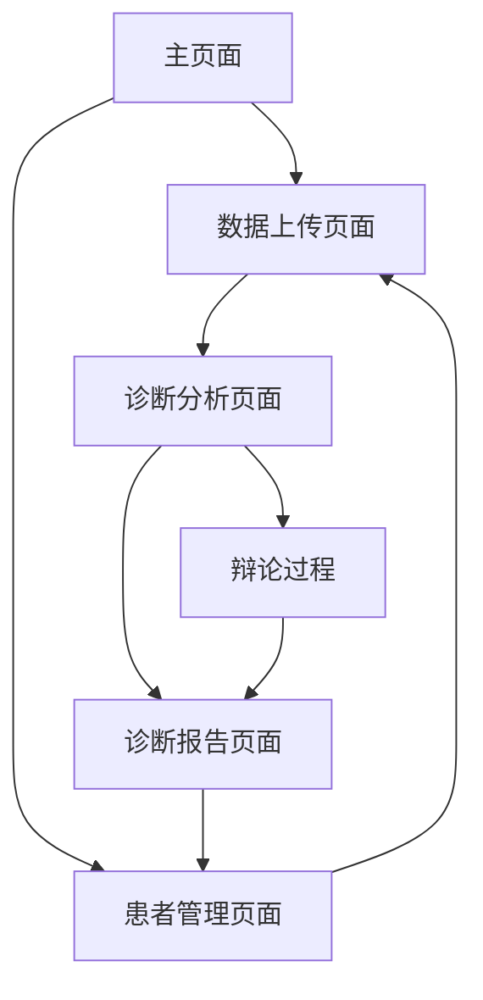

# 连心智诊师 - 产品需求文档

## 1. Product Overview
连心智诊师是一个基于多智能体协作的心理疾病智能诊断系统，通过整合多模态生理数据（fNIRS、EEG、音视频）实现精准的心理健康评估。
- 解决传统心理诊断依赖单一数据源、主观性强的问题，为心理健康专业人士提供客观、全面的诊断辅助工具。
- 目标市场：心理健康诊疗机构、医院精神科、心理咨询中心，预期提升诊断准确率30%以上。

## 2. Core Features

### 2.1 User Roles
| Role | Registration Method | Core Permissions |
|------|---------------------|------------------|
| 医生用户 | 医疗机构邀请码注册 | 上传患者数据、查看完整诊断报告、管理患者档案 |
| 研究人员 | 学术机构认证注册 | 访问匿名化数据、查看诊断过程、导出研究数据 |
| 演示用户 | 无需注册 | 体验基础功能、查看示例诊断流程 |

### 2.2 Feature Module
我们的心理诊断系统包含以下核心页面：
1. **主页面**：系统概览、快速导航、患者信息录入
2. **数据上传页面**：多模态数据上传、数据预处理、质量检查、智能体自动激活
3. **诊断分析页面**：智能体协作过程、实时诊断进度、辩论可视化、流式输出展示
4. **诊断报告页面**：综合诊断结果、证据链展示、治疗建议
5. **患者管理页面**：患者档案管理、历史诊断记录、数据统计

### 2.3 核心交互功能
- **流式输出系统**：AI回复采用打字机效果逐字显示，提升用户体验和专业感
- **智能体动态激活**：根据上传文件类型自动激活对应专业分析师，展示高级动态效果
- **状态动画系统**：智能体激活时显示状态栏动画、进度条动画、工作状态切换等视觉效果

### 2.4 Page Details
| Page Name | Module Name | Feature description |
|-----------|-------------|---------------------|
| 主页面 | 系统概览 | 显示系统状态、在线智能体数量、今日诊断统计 |
| 主页面 | 患者信息录入 | 录入患者基本信息、病史、症状描述，支持语音输入 |
| 主页面 | 快速导航 | 快速访问各功能模块、最近诊断记录、帮助文档 |
| 数据上传页面 | fNIRS数据上传 | 上传fNIRS数据文件、自动格式验证、数据质量评估 |
| 数据上传页面 | EEG数据上传 | 上传EEG数据文件、信号质量检查、伪迹标记 |
| 数据上传页面 | 音视频上传 | 上传患者音视频文件、自动转码、特征提取预览 |
| 数据上传页面 | 数据预处理 | 自动数据清洗、标准化处理、同步对齐 |
| 数据上传页面 | 智能体激活系统 | 根据上传文件类型自动激活对应分析师：.mp4/.avi/.mov激活视频分析师，.mp3/.wav激活音频分析师，.mat激活FNIRS分析师，.edf/.bdf激活EEG分析师，.jpg/.png激活图像分析师 |
| 诊断分析页面 | 总理智能体控制台 | 显示总理智能体决策过程、任务分配状态 |
| 诊断分析页面 | 专业智能体分析 | 实时显示各专业智能体分析进度、初步诊断结果，基于文件类型自动激活对应分析师 |
| 诊断分析页面 | 辩论可视化 | 当诊断冲突时展示辩论过程、论据对比、轮次进度 |
| 诊断分析页面 | 置信度监控 | 实时显示各诊断结果的置信度、一致性评分 |
| 诊断报告页面 | 综合诊断结果 | 展示最终诊断结论、诊断依据、置信度评分 |
| 诊断报告页面 | 证据链展示 | 详细展示各模态数据的分析结果、关键特征标注 |
| 诊断报告页面 | 治疗建议 | 基于诊断结果生成个性化治疗方案、用药建议 |
| 诊断报告页面 | 报告导出 | 支持PDF、Word格式导出、电子签名、打印功能 |
| 患者管理页面 | 患者档案 | 管理患者基本信息、诊断历史、治疗进展 |
| 患者管理页面 | 数据统计 | 诊断准确率统计、疾病分布分析、趋势图表 |

## 3. Core Process

### 医生用户诊断流程
1. 医生登录系统，录入患者基本信息和症状描述
2. 上传患者的fNIRS、EEG、音视频等多模态数据
3. 系统自动进行数据预处理和质量检查
4. 总理智能体启动，将数据分发给各专业智能体进行分析
5. 各专业智能体并行分析，生成初步诊断结果和置信度
6. 如果诊断结果一致，直接生成最终报告；如果不一致，启动辩论机制
7. 辩论智能体基于置信度最高和第二高的诊断展开辩论（最多4轮）
8. 总理智能体综合所有信息，生成最终诊断报告
9. 医生查看报告，可导出或打印，并录入治疗方案

### 演示用户体验流程
1. 访客进入演示模式，查看系统介绍和功能概览
2. 使用预置的示例数据体验诊断流程
3. 观看智能体协作和辩论过程的可视化展示
4. 查看示例诊断报告，了解系统输出格式

## 4. User Interface Design

### 4.1 Design Style
- **主色调**：医疗蓝 (#2E86AB) 和温暖白 (#F8F9FA)，辅助色为警示橙 (#FF6B35) 和成功绿 (#28A745)
- **按钮风格**：圆角矩形按钮，主要按钮采用渐变效果，悬停时有微动画
- **字体**：中文使用思源黑体，英文使用 Roboto，主要字号 14px，标题 18-24px
- **布局风格**：卡片式布局，左侧导航栏，顶部状态栏，支持响应式设计
- **图标风格**：线性图标风格，配合医疗主题的专业图标库

### 4.2 Page Design Overview
| Page Name | Module Name | UI Elements |
|-----------|-------------|-------------|
| 主页面 | 系统概览 | 仪表盘风格，使用圆形进度条显示系统状态，卡片展示统计数据 |
| 主页面 | 患者信息录入 | 分步骤表单，左侧信息录入，右侧实时预览，支持拖拽上传 |
| 数据上传页面 | 文件上传区 | 大尺寸拖拽区域，支持多文件同时上传，实时进度条和质量指示器 |
| 诊断分析页面 | 智能体状态 | 网络拓扑图显示智能体连接，实时状态指示灯，流式文本显示分析过程，支持打字机效果的流式输出 |
| 诊断分析页面 | 辩论可视化 | 对话气泡样式，左右分栏显示辩论双方，轮次进度条，关键论据高亮 |
| 诊断报告页面 | 结果展示 | 大卡片布局，诊断结果用醒目字体，置信度用环形进度条，证据用时间轴展示 |
| 患者管理页面 | 数据表格 | 响应式表格，支持排序筛选，行悬停效果，操作按钮组 |

### 4.3 Responsiveness
系统采用桌面优先设计，同时适配平板设备。在移动端提供简化版界面，重点保证数据查看和基础操作功能。支持触摸手势操作，优化按钮大小和间距以适应触屏交互。