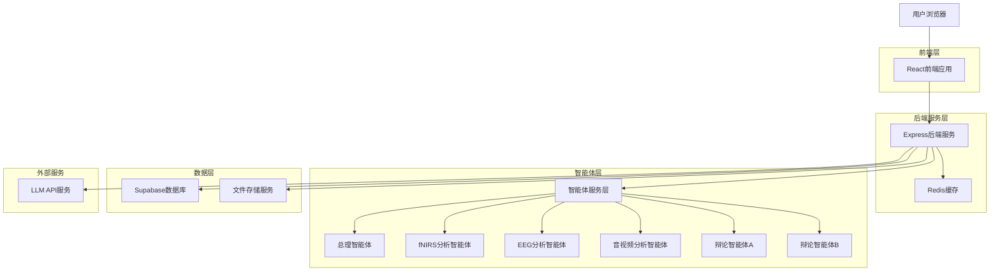
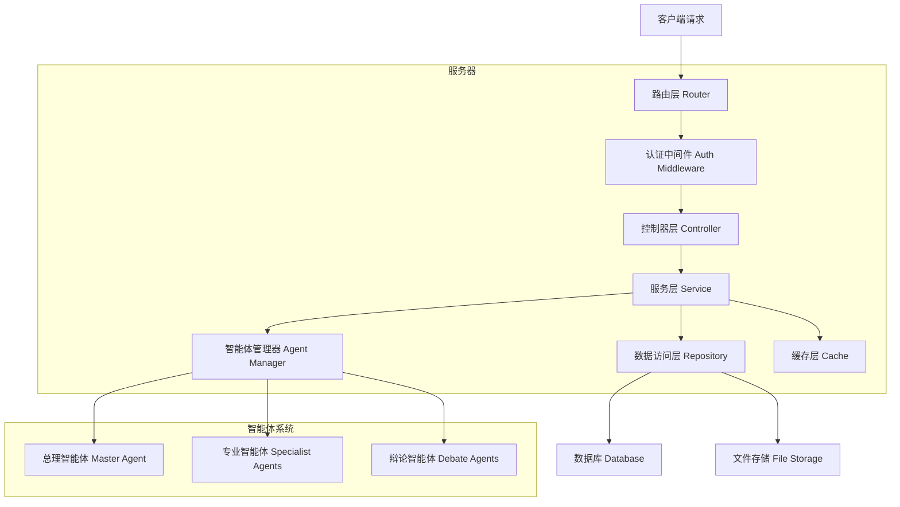
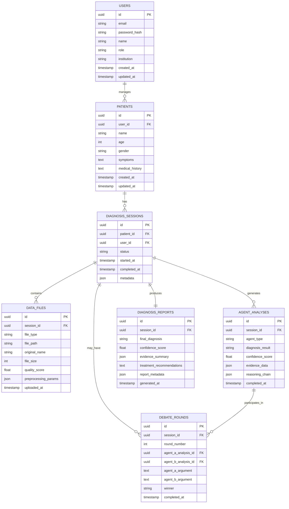

# 连心智诊师 - 技术架构文档

## 1. Architecture design



## 2. Technology Description

* Frontend: React\@18 + TypeScript + Tailwind CSS + Vite + Zustand

* Backend: Express\@4 + TypeScript + Socket.io + Server-Sent Events (SSE)

* Database: Supabase (PostgreSQL)

* File Storage: Supabase Storage

* Cache: Redis\@7

* AI Services: OpenAI GPT-4 + Custom ML Models

* Streaming: Server-Sent Events for real-time AI response streaming

* Animation: Framer Motion + CSS3 Animations for agent status effects

## 3. Route definitions

| Route          | Purpose            |
| -------------- | ------------------ |
| /              | 主页面，显示系统概览和患者信息录入  |
| /upload        | 数据上传页面，处理多模态数据上传   |
| /diagnosis/:id | 诊断分析页面，实时显示智能体协作过程 |
| /report/:id    | 诊断报告页面，展示最终诊断结果    |
| /patients      | 患者管理页面，管理患者档案和历史记录 |
| /login         | 用户登录页面             |
| /register      | 用户注册页面             |
| /demo          | 演示模式页面，展示系统功能      |

## 4. API definitions

### 4.1 Core API

用户认证相关

```
POST /api/auth/login
```

Request:

| Param Name | Param Type | isRequired | Description |
| ---------- | ---------- | ---------- | ----------- |
| email      | string     | true       | 用户邮箱        |
| password   | string     | true       | 用户密码        |

Response:

| Param Name | Param Type | Description |
| ---------- | ---------- | ----------- |
| success    | boolean    | 登录是否成功      |
| token      | string     | JWT认证令牌     |
| user       | object     | 用户信息        |

患者管理相关

```
POST /api/patients
```

Request:

| Param Name | Param Type | isRequired | Description |
| ---------- | ---------- | ---------- | ----------- |
| name       | string     | true       | 患者姓名        |
| age        | number     | true       | 患者年龄        |
| gender     | string     | true       | 患者性别        |
| symptoms   | string     | false      | 症状描述        |
| history    | string     | false      | 病史信息        |

Response:

| Param Name | Param Type | Description |
| ---------- | ---------- | ----------- |
| success    | boolean    | 创建是否成功      |
| patientId  | string     | 患者ID        |

数据上传相关

```
POST /api/upload/fnirs
```

Request:

| Param Name | Param Type | isRequired | Description |
| ---------- | ---------- | ---------- | ----------- |
| patientId  | string     | true       | 患者ID        |
| file       | File       | true       | fNIRS数据文件   |
| metadata   | object     | false      | 元数据信息       |

Response:

| Param Name | Param Type | Description |
| ---------- | ---------- | ----------- |
| success    | boolean    | 上传是否成功      |
| fileId     | string     | 文件ID        |
| quality    | number     | 数据质量评分      |

诊断分析相关

```
POST /api/diagnosis/start
```

Request:

| Param Name | Param Type | isRequired | Description |
| ---------- | ---------- | ---------- | ----------- |
| patientId  | string     | true       | 患者ID        |
| dataFiles  | array      | true       | 数据文件ID列表    |

Response:

| Param Name  | Param Type | Description |
| ----------- | ---------- | ----------- |
| success     | boolean    | 启动是否成功      |
| diagnosisId | string     | 诊断任务ID      |
| status      | string     | 诊断状态        |

流式输出相关

```
GET /api/chat/stream
```

Server-Sent Events 流式响应:

| Event Type | Description |
| ---------- | ----------- |
| message    | AI回复文本流   |
| complete   | 回复完成      |
| error      | 错误信息      |

智能体激活相关

```
POST /api/agents/activate
```

Request:

| Param Name | Param Type | isRequired | Description |
| ---------- | ---------- | ---------- | ----------- |
| fileType   | string     | true       | 文件类型扩展名     |
| fileName   | string     | true       | 文件名         |
| agentType  | string     | true       | 智能体类型       |

Response:

| Param Name | Param Type | Description |
| ---------- | ---------- | ----------- |
| success    | boolean    | 激活是否成功      |
| agentId    | string     | 智能体ID       |
| status     | string     | 激活状态        |

WebSocket事件

```
WS /api/diagnosis/stream
```

事件类型:

| Event Name          | Description |
| ------------------- | ----------- |
| agent\_status       | 智能体状态更新     |
| agent\_activated    | 智能体激活事件     |
| analysis\_progress  | 分析进度更新      |
| debate\_start       | 辩论开始        |
| debate\_round       | 辩论轮次更新      |
| diagnosis\_complete | 诊断完成        |

## 5. Server architecture diagram



## 6. Data model

### 6.1 Data model definition



### 6.2 Data Definition Language

用户表 (users)

```sql
-- 创建用户表
CREATE TABLE users (
    id UUID PRIMARY KEY DEFAULT gen_random_uuid(),
    email VARCHAR(255) UNIQUE NOT NULL,
    password_hash VARCHAR(255) NOT NULL,
    name VARCHAR(100) NOT NULL,
    role VARCHAR(20) DEFAULT 'doctor' CHECK (role IN ('doctor', 'researcher', 'admin')),
    institution VARCHAR(200),
    created_at TIMESTAMP WITH TIME ZONE DEFAULT NOW(),
    updated_at TIMESTAMP WITH TIME ZONE DEFAULT NOW()
);

-- 创建索引
CREATE INDEX idx_users_email ON users(email);
CREATE INDEX idx_users_role ON users(role);
```

患者表 (patients)

```sql
-- 创建患者表
CREATE TABLE patients (
    id UUID PRIMARY KEY DEFAULT gen_random_uuid(),
    user_id UUID REFERENCES users(id) ON DELETE CASCADE,
    name VARCHAR(100) NOT NULL,
    age INTEGER CHECK (age > 0 AND age < 150),
    gender VARCHAR(10) CHECK (gender IN ('male', 'female', 'other')),
    symptoms TEXT,
    medical_history TEXT,
    created_at TIMESTAMP WITH TIME ZONE DEFAULT NOW(),
    updated_at TIMESTAMP WITH TIME ZONE DEFAULT NOW()
);

-- 创建索引
CREATE INDEX idx_patients_user_id ON patients(user_id);
CREATE INDEX idx_patients_created_at ON patients(created_at DESC);
```

诊断会话表 (diagnosis\_sessions)

```sql
-- 创建诊断会话表
CREATE TABLE diagnosis_sessions (
    id UUID PRIMARY KEY DEFAULT gen_random_uuid(),
    patient_id UUID REFERENCES patients(id) ON DELETE CASCADE,
    user_id UUID REFERENCES users(id) ON DELETE CASCADE,
    status VARCHAR(20) DEFAULT 'pending' CHECK (status IN ('pending', 'processing', 'debating', 'completed', 'failed')),
    started_at TIMESTAMP WITH TIME ZONE DEFAULT NOW(),
    completed_at TIMESTAMP WITH TIME ZONE,
    metadata JSONB DEFAULT '{}'
);

-- 创建索引
CREATE INDEX idx_diagnosis_sessions_patient_id ON diagnosis_sessions(patient_id);
CREATE INDEX idx_diagnosis_sessions_status ON diagnosis_sessions(status);
CREATE INDEX idx_diagnosis_sessions_started_at ON diagnosis_sessions(started_at DESC);
```

数据文件表 (data\_files)

```sql
-- 创建数据文件表
CREATE TABLE data_files (
    id UUID PRIMARY KEY DEFAULT gen_random_uuid(),
    session_id UUID REFERENCES diagnosis_sessions(id) ON DELETE CASCADE,
    file_type VARCHAR(20) CHECK (file_type IN ('fnirs', 'eeg', 'video', 'audio', 'image')),
    file_extension VARCHAR(10) NOT NULL,
    file_path VARCHAR(500) NOT NULL,
    original_name VARCHAR(255) NOT NULL,
    file_size BIGINT,
    quality_score FLOAT CHECK (quality_score >= 0 AND quality_score <= 1),
    preprocessing_params JSONB DEFAULT '{}',
    uploaded_at TIMESTAMP WITH TIME ZONE DEFAULT NOW(),
    activated_agent_id UUID
);

-- 创建索引
CREATE INDEX idx_data_files_session_id ON data_files(session_id);
CREATE INDEX idx_data_files_file_type ON data_files(file_type);
```

智能体状态表 (agent\_status)

```sql
-- 创建智能体状态表
CREATE TABLE agent_status (
    id UUID PRIMARY KEY DEFAULT gen_random_uuid(),
    session_id UUID REFERENCES diagnosis_sessions(id) ON DELETE CASCADE,
    agent_type VARCHAR(20) CHECK (agent_type IN ('coordinator', 'fnirs-analyst', 'eeg-analyst', 'video-analyst', 'audio-analyst', 'image-analyst')),
    status VARCHAR(20) DEFAULT 'idle' CHECK (status IN ('idle', 'working', 'completed', 'error')),
    progress INTEGER DEFAULT 0 CHECK (progress >= 0 AND progress <= 100),
    current_task TEXT,
    activated_by_file_type VARCHAR(10),
    animation_state JSONB DEFAULT '{}',
    created_at TIMESTAMP WITH TIME ZONE DEFAULT NOW(),
    updated_at TIMESTAMP WITH TIME ZONE DEFAULT NOW()
);

-- 创建索引
CREATE INDEX idx_agent_status_session_id ON agent_status(session_id);
CREATE INDEX idx_agent_status_agent_type ON agent_status(agent_type);
CREATE INDEX idx_agent_status_status ON agent_status(status);
```

文件类型映射表 (file\_type\_mappings)

```sql
-- 创建文件类型映射表
CREATE TABLE file_type_mappings (
    id UUID PRIMARY KEY DEFAULT gen_random_uuid(),
    file_extension VARCHAR(10) NOT NULL UNIQUE,
    agent_type VARCHAR(20) NOT NULL,
    file_category VARCHAR(20) NOT NULL,
    description TEXT,
    created_at TIMESTAMP WITH TIME ZONE DEFAULT NOW()
);

-- 插入初始映射数据
INSERT INTO file_type_mappings (file_extension, agent_type, file_category, description) VALUES
('.mp4', 'video-analyst', 'video', '视频文件'),
('.avi', 'video-analyst', 'video', '视频文件'),
('.mov', 'video-analyst', 'video', '视频文件'),
('.mp3', 'audio-analyst', 'audio', '音频文件'),
('.wav', 'audio-analyst', 'audio', '音频文件'),
('.mat', 'fnirs-analyst', 'fnirs', 'MATLAB数据文件'),
('.edf', 'eeg-analyst', 'eeg', 'EEG数据文件'),
('.bdf', 'eeg-analyst', 'eeg', 'EEG数据文件'),
('.jpg', 'image-analyst', 'image', '图像文件'),
('.jpeg', 'image-analyst', 'image', '图像文件'),
('.png', 'image-analyst', 'image', '图像文件');

-- 创建索引
CREATE INDEX idx_file_type_mappings_extension ON file_type_mappings(file_extension);
CREATE INDEX idx_file_type_mappings_agent_type ON file_type_mappings(agent_type);
```

智能体分析表 (agent\_analyses)

```sql
-- 创建智能体分析表
CREATE TABLE agent_analyses (
    id UUID PRIMARY KEY DEFAULT gen_random_uuid(),
    session_id UUID REFERENCES diagnosis_sessions(id) ON DELETE CASCADE,
    agent_type VARCHAR(20) CHECK (agent_type IN ('fnirs-analyst', 'eeg-analyst', 'video-analyst', 'audio-analyst', 'image-analyst', 'coordinator')),
    diagnosis_result VARCHAR(100),
    confidence_score FLOAT CHECK (confidence_score >= 0 AND confidence_score <= 1),
    evidence_data JSONB DEFAULT '{}',
    reasoning_chain JSONB DEFAULT '{}',
    streaming_output TEXT,
    completed_at TIMESTAMP WITH TIME ZONE DEFAULT NOW()
);

-- 创建索引
CREATE INDEX idx_agent_analyses_session_id ON agent_analyses(session_id);
CREATE INDEX idx_agent_analyses_agent_type ON agent_analyses(agent_type);
CREATE INDEX idx_agent_analyses_confidence_score ON agent_analyses(confidence_score DESC);
```

辩论轮次表 (debate\_rounds)

```sql
-- 创建辩论轮次表
CREATE TABLE debate_rounds (
    id UUID PRIMARY KEY DEFAULT gen_random_uuid(),
    session_id UUID REFERENCES diagnosis_sessions(id) ON DELETE CASCADE,
    round_number INTEGER CHECK (round_number > 0 AND round_number <= 4),
    agent_a_analysis_id UUID REFERENCES agent_analyses(id),
    agent_b_analysis_id UUID REFERENCES agent_analyses(id),
    agent_a_argument TEXT,
    agent_b_argument TEXT,
    winner VARCHAR(10) CHECK (winner IN ('agent_a', 'agent_b', 'draw')),
    completed_at TIMESTAMP WITH TIME ZONE DEFAULT NOW()
);

-- 创建索引
CREATE INDEX idx_debate_rounds_session_id ON debate_rounds(session_id);
CREATE INDEX idx_debate_rounds_round_number ON debate_rounds(round_number);
```

诊断报告表 (diagnosis\_reports)

```sql
-- 创建诊断报告表
CREATE TABLE diagnosis_reports (
    id UUID PRIMARY KEY DEFAULT gen_random_uuid(),
    session_id UUID REFERENCES diagnosis_sessions(id) ON DELETE CASCADE,
    final_diagnosis VARCHAR(200) NOT NULL,
    confidence_score FLOAT CHECK (confidence_score >= 0 AND confidence_score <= 1),
    evidence_summary JSONB DEFAULT '{}',
    treatment_recommendations TEXT,
    report_metadata JSONB DEFAULT '{}',
    generated_at TIMESTAMP WITH TIME ZONE DEFAULT NOW()
);

-- 创建索引
CREATE INDEX idx_diagnosis_reports_session_id ON diagnosis_reports(session_id);
CREATE INDEX idx_diagnosis_reports_generated_at ON diagnosis_reports(generated_at DESC);
```

权限设置

```sql
-- 为匿名用户授予基本读取权限
GRANT SELECT ON users TO anon;
GRANT SELECT ON patients TO anon;
GRANT SELECT ON diagnosis_sessions TO anon;

-- 为认证用户授予完整权限
GRANT ALL PRIVILEGES ON users TO authenticated;
GRANT ALL PRIVILEGES ON patients TO authenticated;
GRANT ALL PRIVILEGES ON diagnosis_sessions TO authenticated;
GRANT ALL PRIVILEGES ON data_files TO authenticated;
GRANT ALL PRIVILEGES ON agent_analyses TO authenticated;
GRANT ALL PRIVILEGES ON debate_rounds TO authenticated;
GRANT ALL PRIVILEGES ON diagnosis_reports TO authenticated;
```

初始数据

```sql
-- 插入演示用户
INSERT INTO users (email, password_hash, name, role, institution) VALUES
('demo@example.com', '$2b$10$demo_hash', '演示用户', 'doctor', '演示医院'),
('researcher@example.com', '$2b$10$researcher_hash', '研究员', 'researcher', '研究机构');

-- 插入演示患者
INSERT INTO patients (user_id, name, age, gender, symptoms, medical_history) VALUES
((SELECT id FROM users WHERE email = 'demo@example.com'), '王先生', 35, 'male', '情绪低落，睡眠障碍', '无重大疾病史');
```

